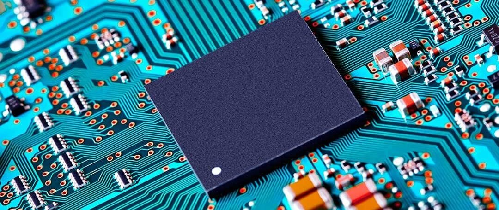
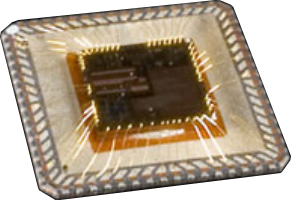
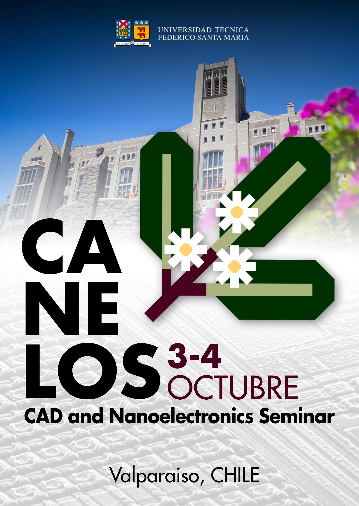

<h1 class="home-title"> ¿Do you have a minute to talk about microelectronics? </h1>
	
<h2 class="home-subtitle"> Meet the IC design student association at UTFSM</h2>

        
	

		What are Integrated Circuits? Commonly known as 'chips', integrated circuits (or ICs) are encapsulated in the plastic or metal blocks 
		found in all the electronic devices we use every day.
	

	

		
  

	

        
	

		
  

	

	

		Inside each package is a piece of silicon that can contain up to billions of transistors.
		These are electrical circuits on a nanometer scale. 
		 
		Microelectronics has evolved rapidly, driving technological development in all aspects of society.
		It has reached an enormous level of complexity, where the design of a single chip involves multiple teams and professionals specialized in different levels of abstraction.
	

ChipUSM is an association that aims for a high technical level in microelectronics, seeking to develop expertise in integrated circuit design.
In a context where Chile has a significant lag in this discipline, we believe that from UTFSM we can catch up, and that students have a central role in this process.

        
	

		 
		In practice, the association is mainly dedicated to supporting students in their learning and practical application of microelectronics. 
		We seek to connect students with the various opportunities available, regardless of their level of experience,
		and also propose instances that reduce the entry barrier to chip design.
		  
		
		Among the activities of ChipUSM are:
		<ul style="text-align: justify">
			<li> Dissemination of information and opportunities </li>
			<li> Technical support in projects and international integrated circuit design competitions </li>
			<li> Maintaining contacts with national and foreign companies, research centers, academics... </li>
			<li> CANELOS nanoelectronics seminar </li>
			<li> Conducting practical courses </li>
		</ul>
	

	

		
	

	