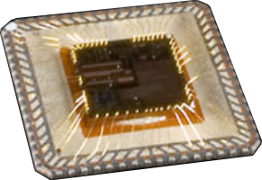
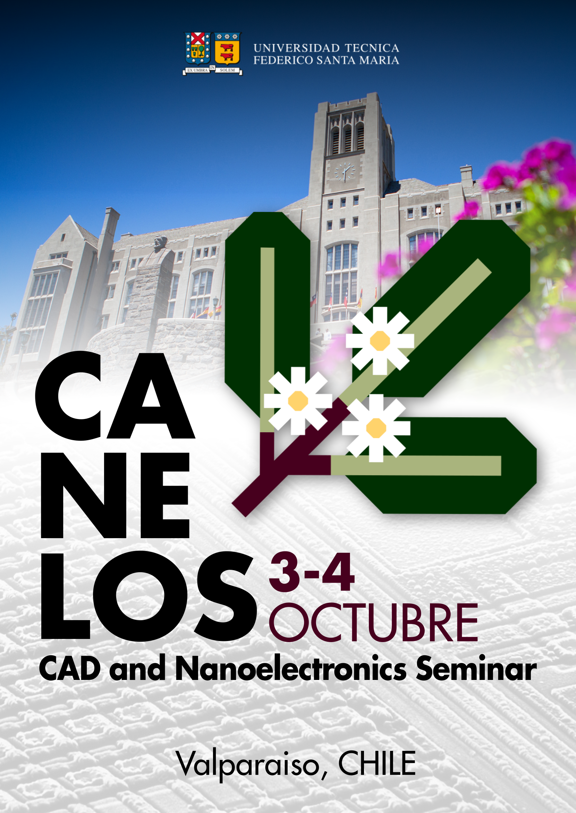

<h1 class="home-title"> ¿Tienes un minuto para hablar de microelectrónica? </h1>
	
<h2 class="home-subtitle"> Descubre la asociación estudiantil Sansana de diseño de CI</h2>

        
	

		¿Qué son los Circuitos Integrados? Comúnmente conocidos como 'chips', los circuitos integrados (o CI) están encapsulados en los bloques plásticos o metálicos 
		que encontramos en todos los dispositivos electrónicos que usamos cada día.
	

	
	

		
  

	

        
	

		
  

	

	
	

		Dentro de cada encapsulado se encuentra un pedazo de silicio que puede contener hasta miles de millones de transistores. 
		Se trata de circuitos eléctricos en escala de nanómetros. 
		 
		La microelectrónica ha evolucionado a paso acelerado, impulsando el desarrollo tecnológico en todos los aspectos de la sociedad.
		Se ha alcanzado un grado enorme de complejidad, donde el diseño de un sólo chip involucra múltiples equipos y profesionales especializados en distintos niveles de abstracción.
	

ChipUSM es una asociación que apunta a un alto nivel técnico en microelectrónica, buscando desarrollar experiencia en el diseño de circuitos integrados. 
En un contexto donde Chile tiene un retraso importante en esta disciplina, creemos que desde la UTFSM podemos ponernos al día y que el estudiantado tiene un rol central en este proceso.

        
	

		 
		En la práctica, la asociación se dedica principalmente a apoyar estudiantes en su aprendizaje y aplicación práctica de la microelectrónica. 
		Buscamos conectar a los y las estudiantes con las distintas oportunidades disponibles, independiente de su nivel de experiencia,
		y también proponer instancias que reduzcan la brecha de entrada al diseño de chips.
		  
		
		Entre las actividades de ChipUSM, destacan:
		<ul style="text-align: justify">
			<li> Difusión de información y oportunidades </li>
			<li> Apoyo técnico en proyectos y concursos internacionales de diseño de circuitos integrados </li>
			<li> Mantención de contactos con empresas nacionales y extranjeras, centros de investigación, académicos(as)... </li>
			<li> Seminario de nanoelectrónica CANELOS </li>
			<li> Realización de cursos prácticos </li>
		</ul>
	

	
	

		
	

